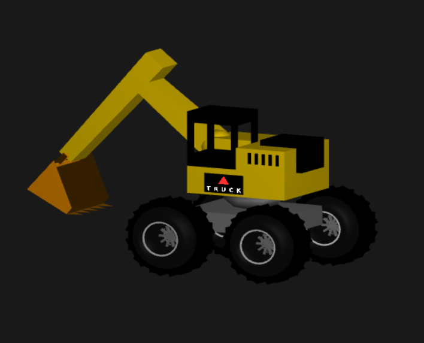

# OpenGL Excavator

以 **C++ 與 OpenGL** 實作的互動式 3D 挖土機模型。

專案利用 OpenGL 的幾何繪製、座標轉換、材質、光照與紋理貼圖建立挖土機外觀，並透過 GLUT 鍵盤事件控制車體移動、上部結構旋轉、機械臂與挖斗，使模型具有基本的互動操作功能。

## Features

- 建立完整的 3D 挖土機模型
- 車體可左右移動，輪胎同步旋轉
- 駕駛艙與機械臂所在的上部結構可旋轉
- 兩段式機械臂可分別調整角度
- 挖斗可上下旋轉
- 自訂輪胎、輪框、輪胎凹槽與結構細節
- 使用自訂多邊形建立機械臂與挖斗
- 使用 OpenGL Lighting 與 Material 呈現立體光影效果
- 使用 `stb_image` 載入 PNG 圖片並進行 Texture Mapping
- 支援 Depth Testing、Double Buffering 與 Multisampling
- 使用鍵盤即時控制模型動作

## Controls

| Key | Function |
| --- | --- |
| `←` | 挖土機向左移動，輪胎同步旋轉 |
| `→` | 挖土機向右移動，輪胎同步旋轉 |
| `↑` | 挖斗向上旋轉 |
| `↓` | 挖斗向下旋轉 |
| `R` / `T` | 控制上部結構向兩個方向旋轉 |
| `A` / `D` | 調整第一段機械臂角度 |
| `W` / `S` | 調整第二段機械臂角度 |

## Implementation Highlights

### Hierarchical Modeling

挖土機由多個獨立部件組合而成，包括：

- Wheels
- Base
- Cabin
- Rotating platform
- Excavator arm
- Bucket

透過 `glPushMatrix()`、`glPopMatrix()` 搭配平移、旋轉與縮放操作建立階層式模型，使駕駛艙、機械臂及挖斗能依照各自的關節與旋轉中心運動。

### Wheel Modeling

輪胎主要使用 `glutSolidTorus()` 建立，並加入：

- 輪框
- 輪輻
- 輪胎凹槽
- 裝飾細節

車體左右移動時，輪胎旋轉角度會同步更新，使移動效果更加自然。

### Excavator Arm & Bucket

機械臂由兩個可獨立旋轉的部分組成，利用矩陣轉換建立關節式運動。

挖斗則使用 `GL_QUADS` 與 `GL_TRIANGLES` 自行定義幾何形狀，並加入多個斗齒，使模型具有更完整的挖土機外觀。

### Texture Mapping

使用 `stb_image.h` 載入：

```text
truck_text.png
```

再利用 OpenGL Texture Mapping 將圖案貼至挖土機兩側，並啟用 Alpha Blending 處理透明背景。

### Lighting & Materials

使用 OpenGL Lighting 與 Material 系統設定模型的：

- Ambient
- Diffuse
- Specular
- Shininess

搭配 `GL_LIGHT0` 建立基本光源，使不同材質與零件呈現立體效果。

### Rendering

程式使用：

```cpp
GLUT_DOUBLE
GLUT_RGB
GLUT_DEPTH
GLUT_MULTISAMPLE
```

並啟用：

- Depth Testing
- Normalization
- Multisampling
- Line Smoothing
- Polygon Smoothing
- Alpha Blending

以改善 3D 模型的顯示品質。

## Technologies Used

- C++
- OpenGL
- GLUT
- GLU
- stb_image
- Visual Studio
- NuGet
- nupengl.core

## Project Structure

```text
opengl-excavator/
├── 1122913_mid_Project.sln
├── 1122913_mid_Project/
│   ├── 1122913_mid_Project.cpp
│   ├── 1122913_mid_Project.vcxproj
│   ├── 1122913_mid_Project.vcxproj.filters
│   ├── packages.config
│   ├── stb_image.h
│   └── truck_text.png
├── excavator-demo.jpg
└── .gitignore
```

## Getting Started

### 1. Clone the repository

```bash
git clone https://github.com/Renee1206/opengl-excavator.git
cd opengl-excavator
```

### 2. Open the Visual Studio solution

使用 Visual Studio 開啟：

```text
1122913_mid_Project.sln
```

本專案使用 **MSVC v143**，建議使用 Visual Studio 2022，並安裝：

```text
Desktop development with C++
```

### 3. Restore NuGet Packages

專案使用以下 NuGet 套件：

```text
nupengl.core 0.1.0.1
nupengl.core.redist 0.1.0.1
```

若開啟專案後出現缺少 OpenGL 或 NuGet 套件的錯誤，請在 Visual Studio 中執行：

```text
Restore NuGet Packages
```

### 4. Check the texture file

程式會使用相對路徑載入：

```text
truck_text.png
```

請確認圖片位於程式執行時的 Working Directory 中。

在 Visual Studio 中，建議將 Working Directory 設定為：

```text
$(ProjectDir)
```

如此程式即可從專案資料夾中讀取 `truck_text.png`。

如果使用預設的輸出資料夾執行程式，也可以將圖片複製到：

```text
x64\Debug\
```

或：

```text
x64\Release\
```

否則程式可能會因無法載入紋理而結束。

### 5. Build and Run

在 Visual Studio 中選擇適當的平台，例如：

```text
Debug | Win32
```

或：

```text
Debug | x64
```

接著執行 Build 並啟動專案，即可使用鍵盤操作 3D 挖土機。

## 3D Model Preview


